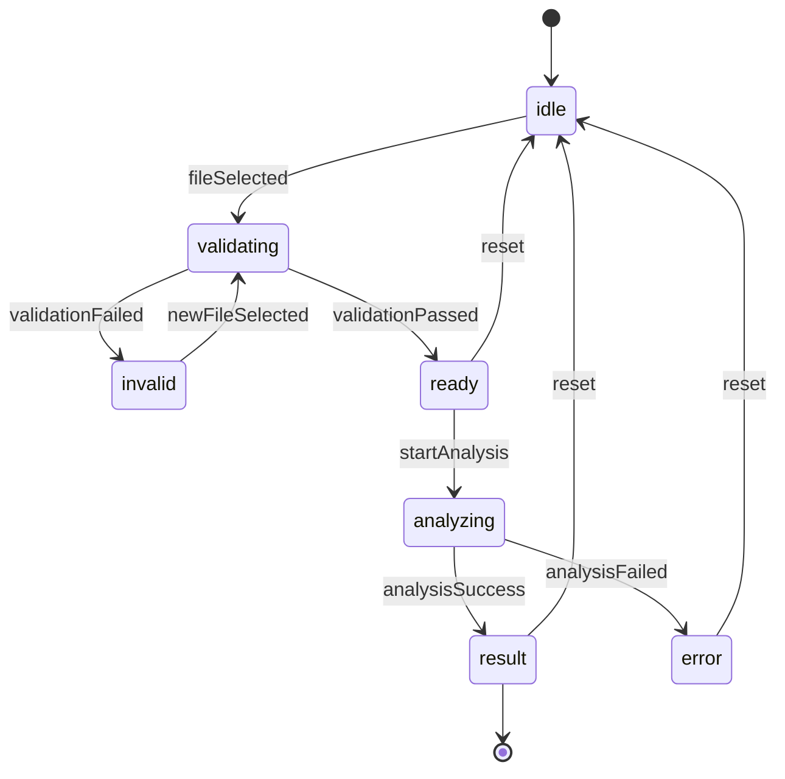

# Діаграма станів компонента PhotoUploader

```mermaid
stateDiagram-v2
    [*] --> idle
    idle --> validating : fileSelected
    validating --> invalid : validationFailed
    validating --> ready : validationPassed
    invalid --> validating : newFileSelected
    ready --> analyzing : startAnalysis
    ready --> idle : reset
    analyzing --> result : analysisSuccess
    analyzing --> error : analysisFailed
    result --> idle : reset
    error --> idle : reset
    result --> [*]
```
