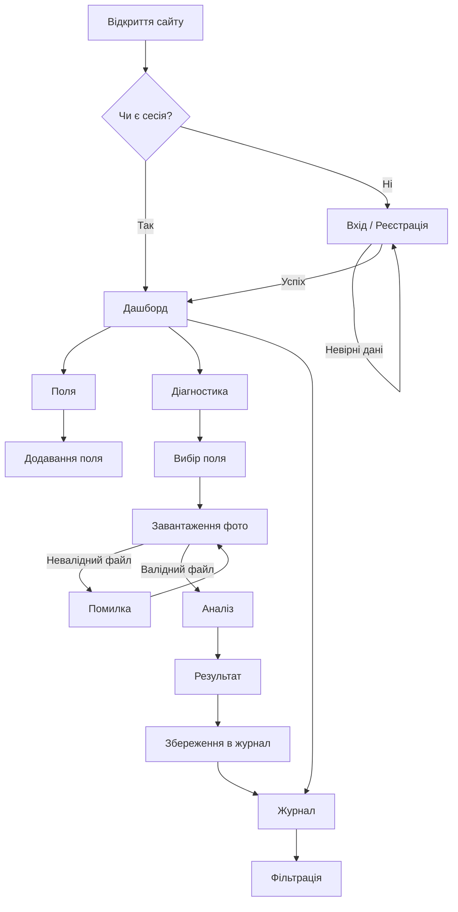

# Діаграма потоку користувача

```mermaid
flowchart TD
    A[Відкриття сайту] --> B{Чи є сесія?}
    B -- Так --> C[Дашборд]
    B -- Ні --> D[Вхід / Реєстрація]
    D -- Невірні дані --> D
    D -- Успіх --> C
    C --> E[Поля]
    E --> E1[Додавання поля]
    C --> F[Діагностика]
    F --> F1[Вибір поля]
    F1 --> F2[Завантаження фото]
    F2 -- Невалідний файл --> F3[Помилка]
    F3 --> F2
    F2 -- Валідний файл --> F4[Аналіз]
    F4 --> F5[Результат]
    F5 --> F6[Збереження в журнал]
    C --> G[Журнал]
    F6 --> G
    G --> G1[Фільтрація]
```
